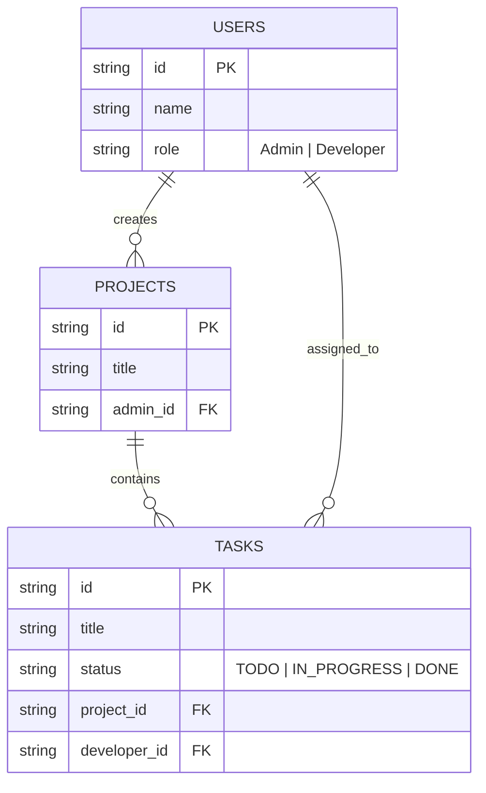

# Synapse: Entity-Relationship Diagram

```mermaid
erDiagram
    USERS {
        string id PK
        string name
        string role "Admin | Developer"
    }

    PROJECTS {
        string id PK
        string title
        string admin_id FK
    }

    TASKS {
        string id PK
        string title
        string status "TODO | IN_PROGRESS | DONE"
        string project_id FK
        string developer_id FK
    }

    USERS ||--o{ PROJECTS : "creates"
    PROJECTS ||--o{ TASKS : "contains"
    USERS ||--o{ TASKS : "assigned_to"
```
