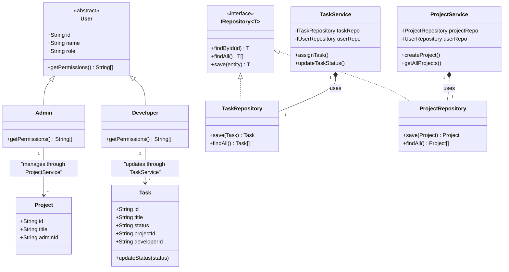

# TaskFlow: Class Diagram

```mermaid
classDiagram
    class User {
        <<abstract>>
        +String id
        +String name
        +String role
        +getPermissions() String[]
    }
    
    class Admin {
        +getPermissions() String[]
    }
    
    class Developer {
        +getPermissions() String[]
    }

    User <|-- Admin
    User <|-- Developer

    class Task {
        +String id
        +String title
        +String status
        +String projectId
        +String developerId
        +updateStatus(status)
    }

    class Project {
        +String id
        +String title
        +String adminId
    }

    class IRepository~T~ {
        <<interface>>
        +findById(id) T
        +findAll() T[]
        +save(entity) T
    }
    
    class TaskRepository {
        +save(Task) Task
        +findAll() Task[]
    }

    class ProjectRepository {
        +save(Project) Project
        +findAll() Project[]
    }

    class TaskService {
        -ITaskRepository taskRepo
        -IUserRepository userRepo
        +assignTask()
        +updateTaskStatus()
    }

    class ProjectService {
        -IProjectRepository projectRepo
        -IUserRepository userRepo
        +createProject()
        +getAllProjects()
    }

    IRepository <|.. TaskRepository
    IRepository <|.. ProjectRepository
    TaskService "1" *-- "1" TaskRepository : uses
    ProjectService "1" *-- "1" ProjectRepository : uses
    Admin "1" --> "*" Project : "manages through ProjectService"
    Developer "1" --> "*" Task : "updates through TaskService"
```
