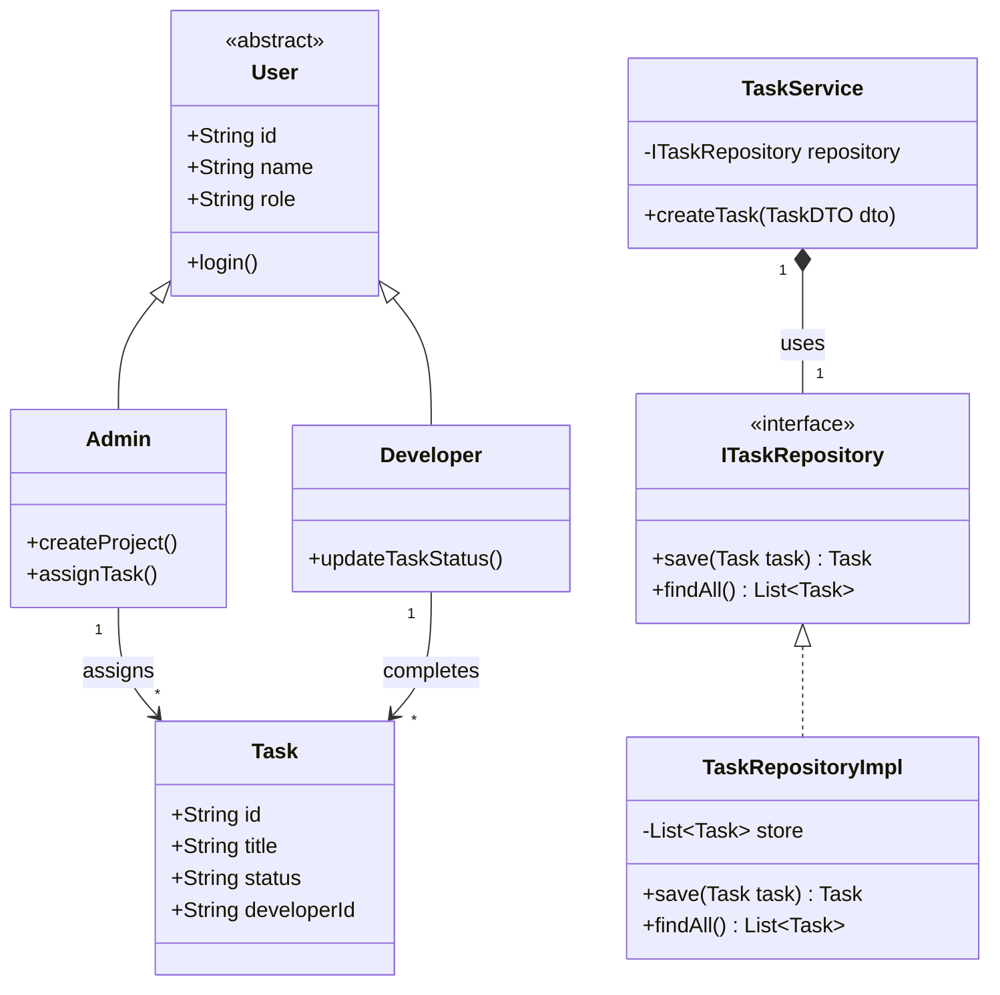

# TaskFlow: Class Diagram

```mermaid
classDiagram
    class User {
        <<abstract>>
        +String id
        +String name
        +String role
        +login()
    }
    
    class Admin {
        +createProject()
        +assignTask()
    }
    
    class Developer {
        +updateTaskStatus()
    }

    User <|-- Admin
    User <|-- Developer

    class Task {
        +String id
        +String title
        +String status
        +String developerId
    }

    class ITaskRepository {
        <<interface>>
        +save(Task task) Task
        +findAll() List~Task~
    }
    
    class TaskRepositoryImpl {
        -List~Task~ store
        +save(Task task) Task
        +findAll() List~Task~
    }

    class TaskService {
        -ITaskRepository repository
        +createTask(TaskDTO dto)
    }

    ITaskRepository <|.. TaskRepositoryImpl
    TaskService "1" *-- "1" ITaskRepository : uses
    Admin "1" --> "*" Task : assigns
    Developer "1" --> "*" Task : completes
```
