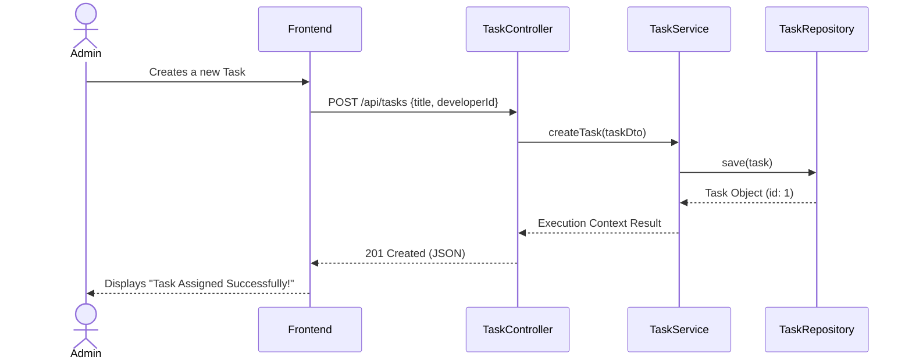

# TaskFlow: Sequence Diagram

```mermaid
sequenceDiagram
    actor Admin
    participant Frontend
    participant TaskController
    participant TaskService
    participant TaskRepository

    Admin->>Frontend: Creates a new Task
    Frontend->>TaskController: POST /api/tasks {title, developerId}
    TaskController->>TaskService: createTask(taskDto)
    TaskService->>TaskRepository: save(task)
    TaskRepository-->>TaskService: Task Object (id: 1)
    TaskService-->>TaskController: Execution Context Result
    TaskController-->>Frontend: 201 Created (JSON)
    Frontend-->>Admin: Displays "Task Assigned Successfully!"
```
