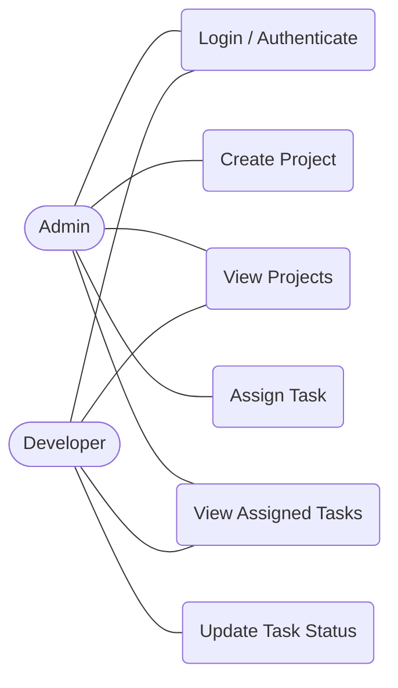

# Synapse: System Use Case Diagram

```mermaid
flowchart LR
    Admin([Admin])
    Developer([Developer])

    UC1(Login / Authenticate)
    UC2(Create Project)
    UC3(View Projects)
    UC4(Assign Task)
    UC5(Update Task Status)
    UC6(View Assigned Tasks)

    Admin --- UC1
    Admin --- UC2
    Admin --- UC3
    Admin --- UC4
    Admin --- UC6
    
    Developer --- UC1
    Developer --- UC3
    Developer --- UC5
    Developer --- UC6
```
